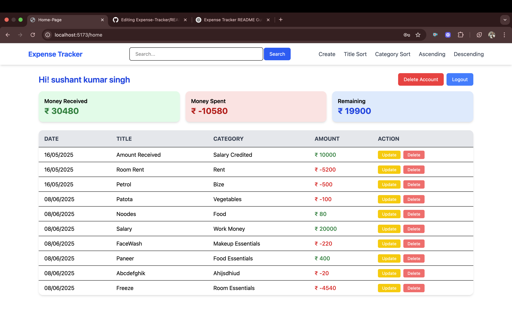
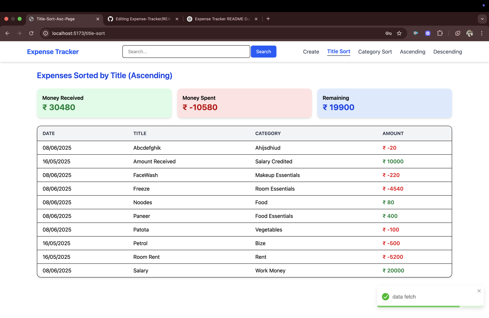

# 💸 Expense Tracker

An intuitive web-based Expense Tracker that allows users to manage their income and expenses effectively. Built using **React.js**, **Node.js**, **Express.js**, and **MongoDB**, this full-stack application supports authentication, user-specific operations, and a clean UI with **Tailwind CSS**.

## 🔗 Live Demo

🚀 [Live Website](https://expense-tracker-frontend-45xu.onrender.com/) *(Now it is Live)*

---

## 📸 Screenshots

### Homepage


### Index Page


### Login Page


### Search Page


### Sort Page By Title


** And many Other Pages like Create Page, Logout, Edit-expense and delete-user page **
---

## 🛠 Features

- 🔐 User Authentication (Signup, Login, Logout)
- ➕ Add Income/Expense entries
- 🧾 View all transactions
- 🔍 Filter transactions by amount/date
- ✏️ Update or delete any transaction
- 👤 Delete user account
- 🎨 Tailwind CSS styled UI
- 🍪 Uses localStorage and cookies for session handling

---

## 🚀 Getting Started

### 📁 Clone the repository

```bash
git clone https://github.com/sushants2711/Expense-Tracker.git
cd Expense-Tracker

cd backend
npm install

Before starting the backend server, create a .env file inside the backend/ directory to store your environment variables.
PORT=1200
MONGO_URL=your_mongodb_connection_string
JWT_SECRET=your_jwt_secret_key
NODE_ENV=development

cd ../frontend
npm install

cd backend
npm start

cd ../frontend
npm start

Expense-Tracker/
├── backend/                   # Node.js + Express Backend
│   ├── config/                # DB config (e.g., MongoDB connection)
│   ├── controllers/           # Route handlers
│   ├── models/                # Mongoose schemas
│   ├── routes/                # API route definitions
│   ├── index.js               # Entry point (uses .env variables)
│   └── .env                   # Environment config
│
├── frontend/                  # React + Tailwind Frontend
│   └── src/
│       ├── api/               # API calls
│       ├── components/        # Reusable UI components
│       ├── context_api/       # React Context for global state
│       ├── toast_message/     # Toast utilities
│       ├── pages/             # Application pages
│       └── routes/            # Route definitions
│
└── README.md

